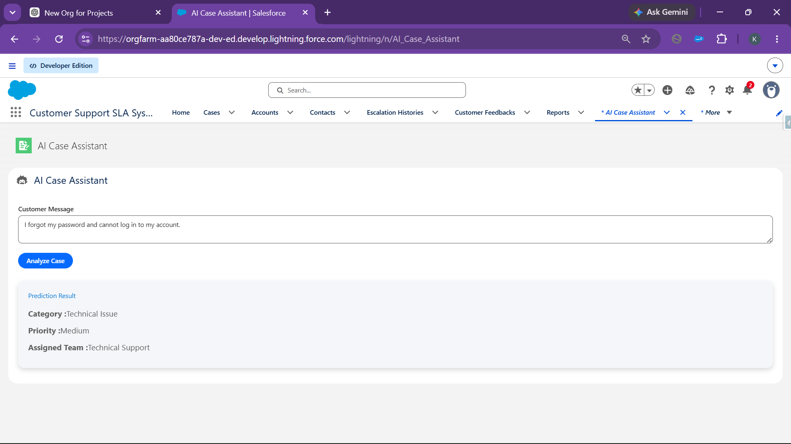

# Chapter 10 – AI Feature Documentation

## Overview

The Customer Support SLA Management System includes an AI-inspired Case Classification feature that helps support agents quickly identify the appropriate category, priority, and support team for incoming customer requests.

Instead of manually reviewing every support message, the system analyzes the customer’s text using keyword-based matching and automatically recommends the most suitable classification.

Although this implementation uses keyword matching rather than a machine learning model, it demonstrates how Artificial Intelligence concepts can be integrated into Salesforce applications to improve productivity and reduce manual effort.

---

# AI Feature – Smart Case Classification

## Purpose

The AI Case Assistant automatically analyzes customer messages and predicts:

- Case Category
- Case Priority
- Support Team

This assists support agents in routing cases more quickly and consistently.

---

## How It Works

1. The support agent enters a customer message.
2. The message is sent to the Apex Controller.
3. The controller checks the message for predefined keywords.
4. Based on the matched keywords, the system returns:
   - Category
   - Priority
   - Support Team
5. The prediction is displayed instantly in the Lightning Web Component.

---

# Keyword Matching Logic

The application uses simple keyword matching to simulate AI-based classification.

| Keywords Detected | Category | Priority | Assigned Team |
|-------------------|----------|----------|---------------|
| payment, refund, transaction | Payment Issue | High | Finance |
| login, password, otp | Technical Issue | Medium | Technical Support |
| delivery, courier, shipment, tracking | Delivery Issue | Medium | Logistics |
| Any other message | General Inquiry | Low | Customer Support |

---

# Input & Output Examples

## Scenario 1 – Payment Issue

### Customer Message

```
My payment failed while placing my order.
```

### AI Prediction

| Field | Result |
|--------|--------|
| Category | Payment Issue |
| Priority | High |
| Team | Finance |

### Explanation

The message contains the keyword **payment**, so the system classifies it as a **Payment Issue**, assigns **High Priority**, and routes it to the **Finance Team**.

### Screenshot

```markdown

```

---

## Scenario 2 – Technical Issue

### Customer Message

```
I forgot my password and cannot log in.
```

### AI Prediction

| Field | Result |
|--------|--------|
| Category | Technical Issue |
| Priority | Medium |
| Team | Technical Support |

### Explanation

The keyword **password** matches the Technical Issue category, so the case is assigned to the **Technical Support Team** with **Medium Priority**.

### Screenshot

```markdown

```

---

## Scenario 3 – Delivery Issue

### Customer Message

```
My shipment has not arrived yet.
```

### AI Prediction

| Field | Result |
|--------|--------|
| Category | Delivery Issue |
| Priority | Medium |
| Team | Logistics |

### Explanation

The keyword **shipment** indicates a delivery-related problem, so the case is classified as a **Delivery Issue** and routed to the **Logistics Team**.

### Screenshot

```markdown

```

---

## Scenario 4 – General Inquiry

### Customer Message

```
Can you tell me your business hours?
```

### AI Prediction

| Field | Result |
|--------|--------|
| Category | General Inquiry |
| Priority | Low |
| Team | Customer Support |

### Explanation

Since no predefined keywords are found, the system classifies the request as a **General Inquiry**, assigns **Low Priority**, and routes it to the **Customer Support Team**.

### Screenshot

```markdown

```

---

# Business Benefits

The AI Case Assistant provides several advantages:

- Reduces manual case classification.
- Improves consistency in case routing.
- Saves support agents time.
- Enables faster response to customer issues.
- Demonstrates AI-inspired automation within Salesforce.
- Provides a scalable foundation for future integration with Salesforce Einstein AI or external AI services.

---

# AI Feature Summary

| Feature | Description |
|----------|-------------|
| Customer Message Input | Accepts customer issue description |
| AI Processing | Keyword-based analysis in Apex |
| Classification | Determines Category, Priority, and Team |
| User Interface | Lightning Web Component |
| Business Value | Faster and more accurate case routing |

---

# Conclusion

The AI Case Assistant enhances the Customer Support SLA Management System by automating the initial case classification process. 
Using keyword-based logic, it provides quick recommendations for case category, priority, and team assignment. 
While simple in implementation, this feature demonstrates how intelligent automation can improve customer support workflows 
and can be extended in the future using advanced AI technologies such as Salesforce Einstein AI or external Large Language Models (LLMs).