# Chapter 6 – Apex Documentation

## Overview

Apex is used in the Customer Support SLA Management System to implement custom business logic that cannot be achieved using declarative Salesforce tools alone. The Apex classes developed in this project support case processing, SLA monitoring, dashboard data retrieval, customer information display, scheduled automation, and AI-assisted case classification.

The project contains the following Apex classes:

- CaseTriggerHandler
- CaseEscalationService
- CaseEscalationBatch
- CaseEscalationScheduler
- SupportDashboardController
- SupportCustomer360Controller
- SLAMonitoringController
- AICaseAssistantController

---

# 1. CaseTriggerHandler

## Purpose

Handles custom business logic when Case records are inserted or updated. It acts as the central handler for Case Trigger events and keeps the trigger lightweight and maintainable.

## Methods

| Method | Purpose |
|---------|---------|
| handleAfterUpdate() | Executes business logic after a Case record is updated. |

## Input

- Case records from the Trigger context.

## Output

- Executes custom business logic.
- Calls the appropriate Apex services when required.

## Business Benefits

- Keeps trigger logic organized.
- Improves code readability.
- Supports future enhancements.

## Screenshot

```markdown
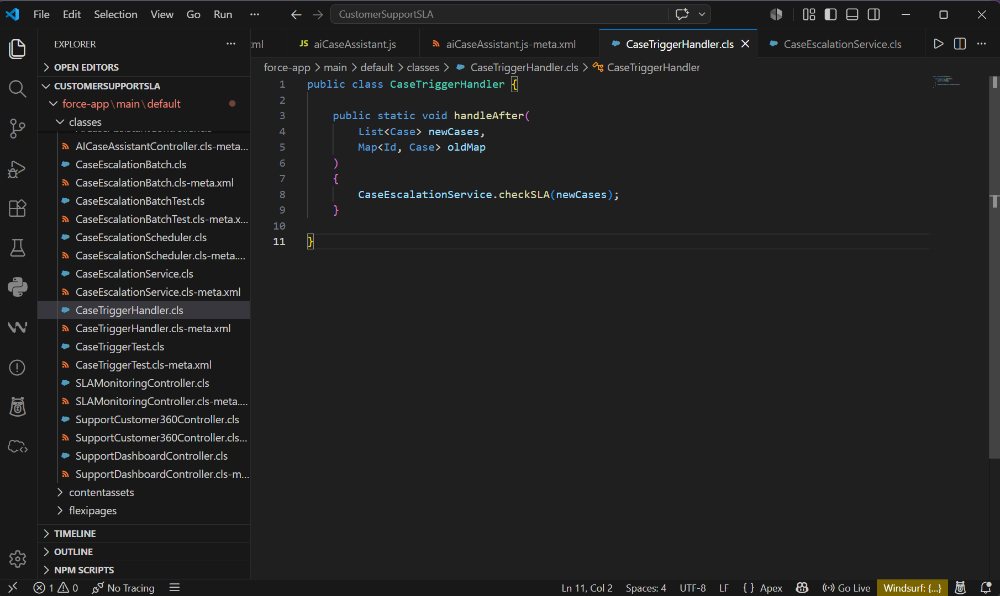
```

---

# 2. CaseEscalationService

## Purpose

Contains the business logic responsible for identifying overdue support cases and updating their escalation status.

## Methods

| Method | Purpose |
|---------|---------|
| escalateCases() | Identifies SLA-breached cases and updates escalation details. |

## Input

- List of open Case records.

## Output

- Updates Escalation Status.
- Marks SLA Violation.
- Returns updated Case records.

## Business Benefits

- Centralizes escalation logic.
- Promotes code reusability.
- Improves maintainability.

## Screenshot

```markdown
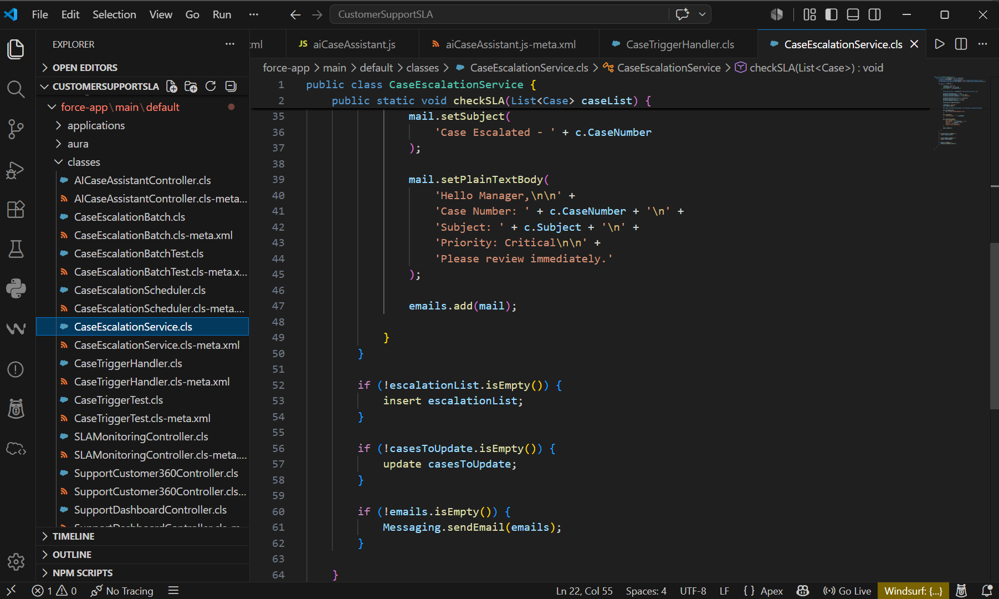
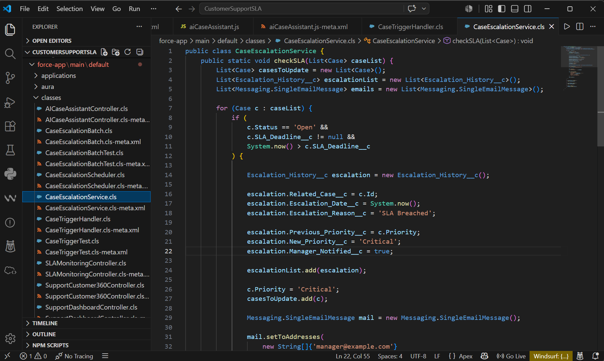
```

---

# 3. CaseEscalationBatch

## Purpose

Processes large numbers of overdue support cases using Salesforce Batch Apex.

## Methods

| Method | Purpose |
|---------|---------|
| start() | Retrieves overdue cases. |
| execute() | Processes each batch of cases. |
| finish() | Executes after all batches complete. |

## Input

- Batch of Case records.

## Output

- Updates escalated cases.
- Improves performance when processing large data volumes.

## Business Benefits

- Supports large-scale processing.
- Prevents governor limit issues.
- Automates mass escalation.

## Screenshot

```markdown
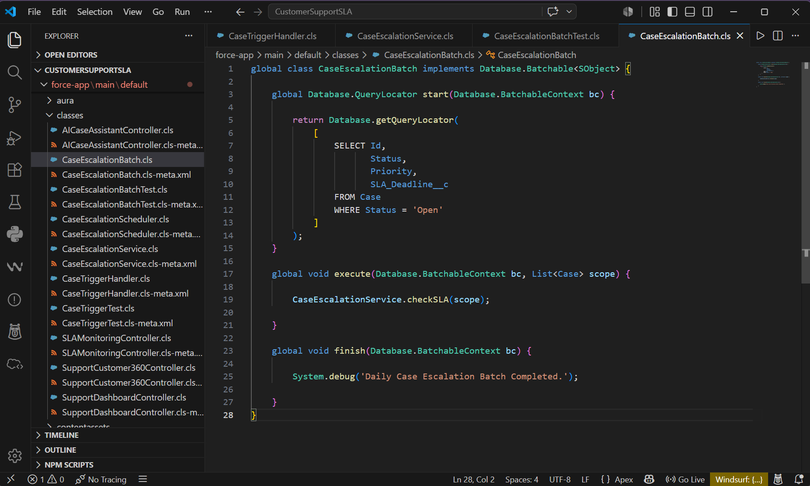
```

---

# 4. CaseEscalationScheduler

## Purpose

Schedules the Batch Apex job to automatically execute at predefined intervals.

## Methods

| Method | Purpose |
|---------|---------|
| execute() | Starts the Batch Apex process according to the schedule. |

## Input

- Scheduled execution.

## Output

- Launches the Case Escalation Batch.

## Business Benefits

- Fully automated escalation process.
- No manual intervention required.
- Ensures continuous SLA monitoring.

## Screenshot

```markdown
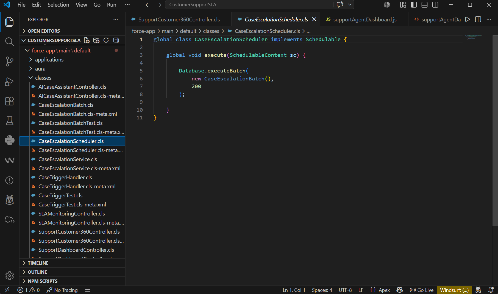
```

---

# 5. SupportDashboardController

## Purpose

Provides dashboard data for the Support Agent Dashboard Lightning Web Component.

## Methods

| Method | Purpose |
|---------|---------|
| getDashboardData() | Retrieves dashboard statistics for support agents. |

## Input

- No user input.

## Output

Returns:

- Assigned Cases
- Open Cases
- Closed Cases
- High Priority Cases

## Business Benefits

- Displays real-time dashboard metrics.
- Helps agents monitor workload.
- Improves productivity.

## Screenshot

```markdown
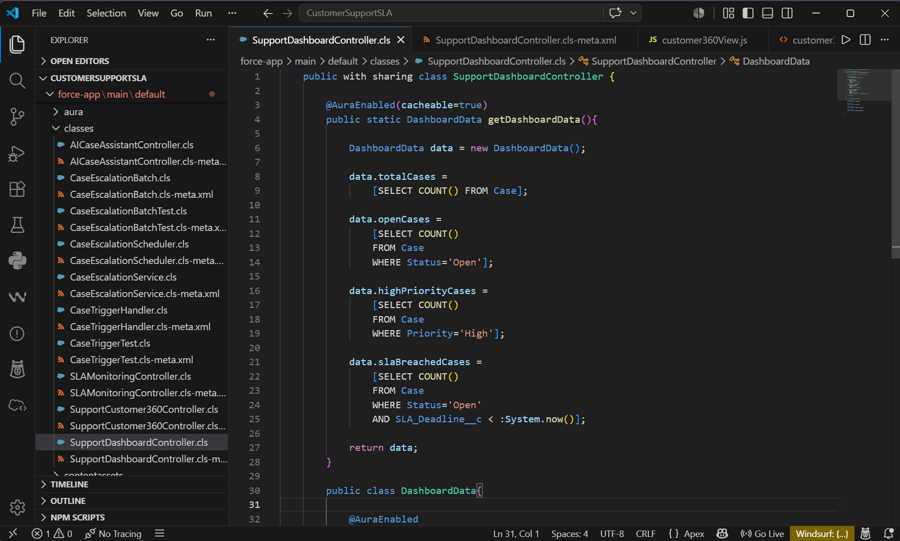
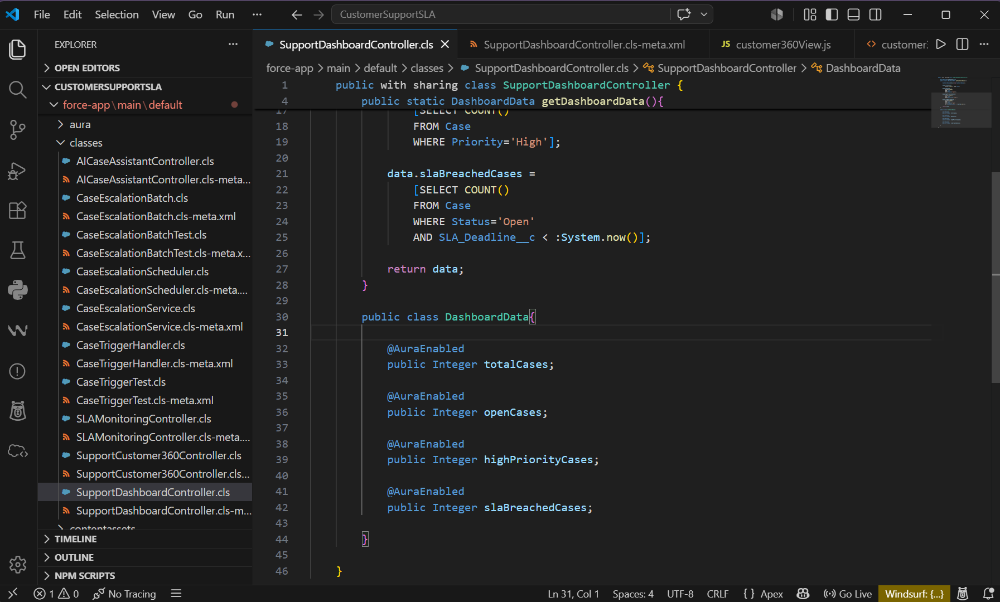
```

---

# 6. SupportCustomer360Controller

## Purpose

Retrieves complete customer information for the Customer 360 Lightning Web Component.

## Methods

| Method | Purpose |
|---------|---------|
| getCustomer360() | Returns customer profile, cases, and feedback. |

## Input

- Case Id

## Output

Returns:

- Contact Information
- Account Details
- Previous Cases
- Customer Feedback

## Business Benefits

- Provides a 360-degree customer view.
- Helps support agents resolve issues faster.
- Improves customer experience.

## Screenshot

```markdown
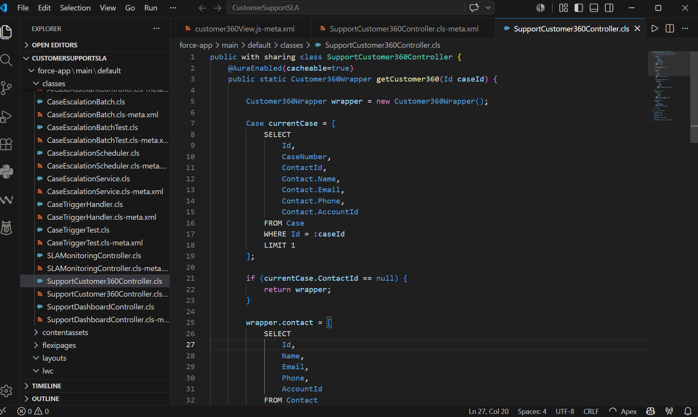
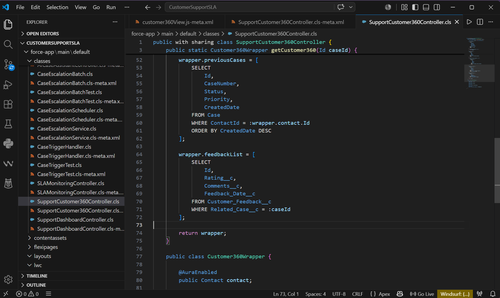
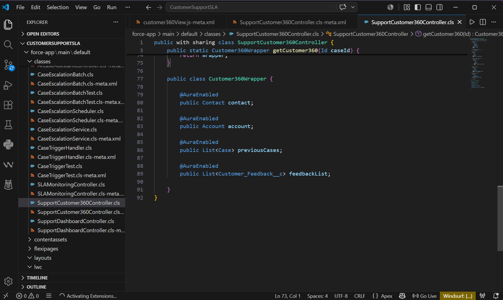
```

---

# 7. SLAMonitoringController

## Purpose

Provides SLA performance metrics for the SLA Monitoring Dashboard.

## Methods

| Method | Purpose |
|---------|---------|
| getDashboardData() | Calculates SLA metrics and returns dashboard data. |

## Input

- No user input.

## Output

Returns:

- SLA Compliance Percentage
- Average Resolution Time
- Breached Cases
- Average Customer Rating

## Business Benefits

- Enables SLA monitoring.
- Helps managers identify overdue cases.
- Supports operational reporting.

## Screenshot

```markdown
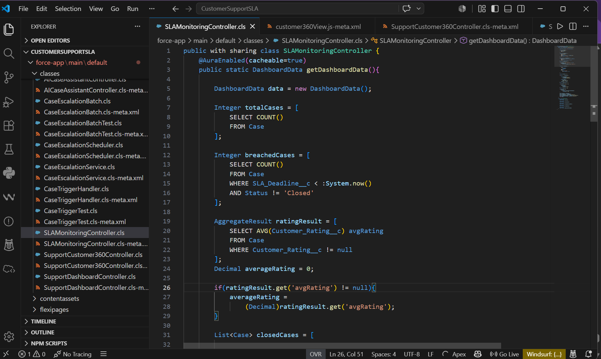
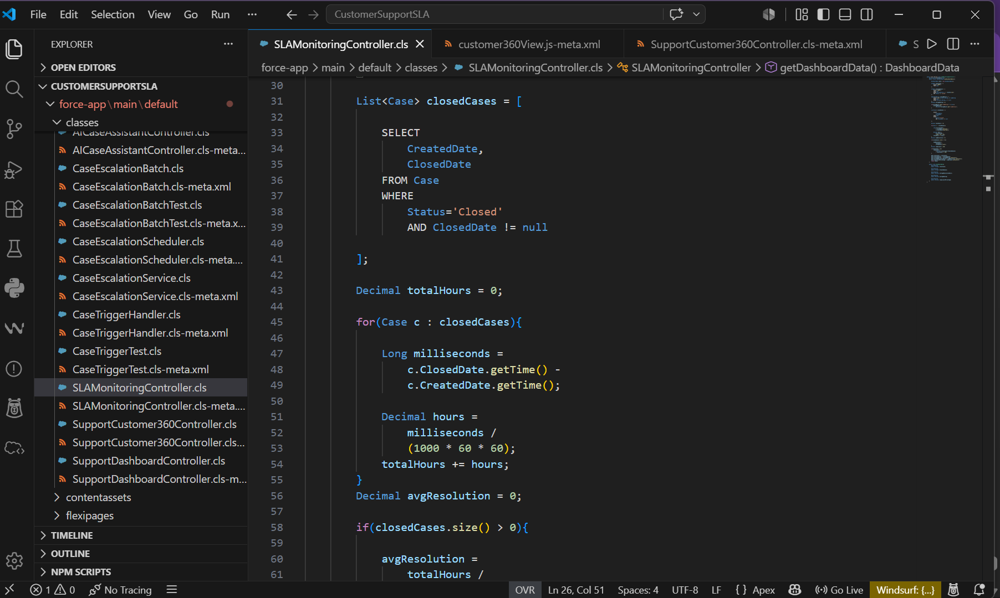
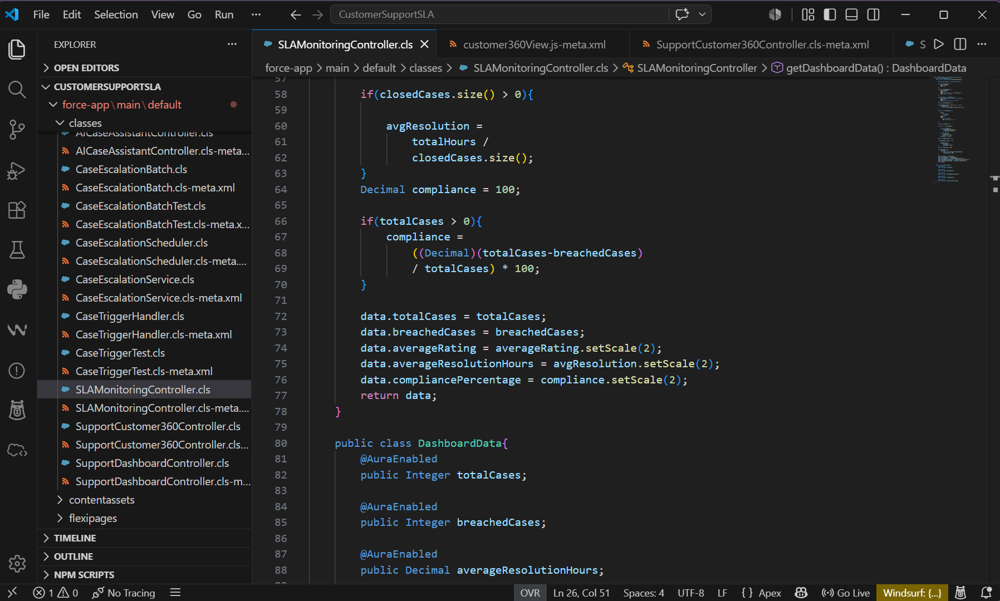
```

---

# 8. AICaseAssistantController

## Purpose

Implements keyword-based AI logic to classify customer messages and recommend the appropriate Category, Priority, and Support Team.

## Methods

| Method | Purpose |
|---------|---------|
| classifyCase() | Analyzes customer messages and predicts case details. |

## Input

- Customer Message (String)

Example:

```
My payment failed yesterday.
```

## Output

Returns:

- Category
- Priority
- Team

Example:

Category : Payment Issue

Priority : High

Team : Finance

## Business Benefits

- Reduces manual case classification.
- Improves routing accuracy.
- Demonstrates AI-inspired automation.

## Screenshot

```markdown
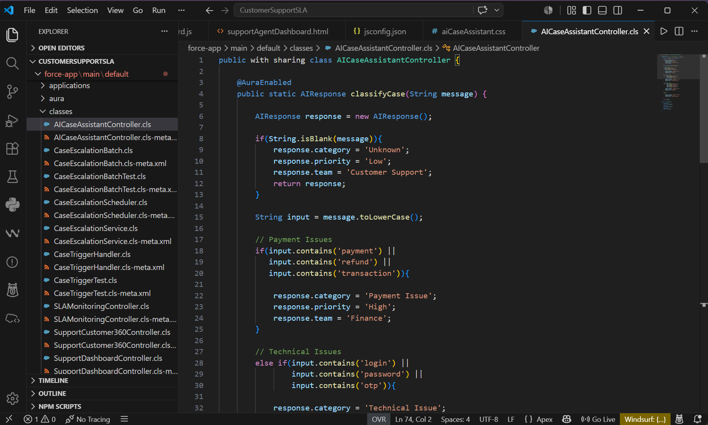
```

---

# Apex Summary

| Apex Class | Purpose |
|-------------|---------|
| CaseTriggerHandler | Handles Case trigger logic |
| CaseEscalationService | Implements SLA escalation logic |
| CaseEscalationBatch | Processes escalations in batches |
| CaseEscalationScheduler | Schedules the batch job |
| SupportDashboardController | Provides Support Dashboard data |
| SupportCustomer360Controller | Retrieves Customer 360 information |
| SLAMonitoringController | Calculates SLA metrics |
| AICaseAssistantController | Performs AI-based case classification |

---

# Conclusion

The Apex layer extends Salesforce's standard functionality by implementing custom business logic, automated case escalation, 
dashboard data retrieval, customer information management, and AI-assisted case classification. Together with Flows and Lightning 
Web Components, these Apex classes create a scalable, maintainable, and efficient customer support solution that improves 
operational productivity and enhances customer service.