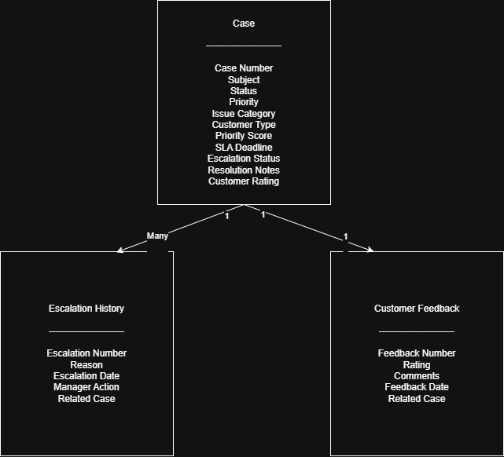

# Chapter 3 – Data Model Diagram

## Overview

The Customer Support SLA Management System is built using both standard Salesforce objects and custom objects to efficiently manage customer support operations, SLA tracking, feedback collection, and case escalation.

The data model is designed to maintain clear relationships between customers, support cases, and related business processes while ensuring scalability and easy maintenance.

---

## Data Model Diagram

> **Insert your Data Model Diagram here**

```text
Account
   │
   ▼
Contact
   │
   ▼
Case
   ├──────────────► Customer Feedback
   │
   ▼
Escalation History
```

**GitHub Image (after uploading):**

```markdown

```

---

# Objects Used

## 1. Account (Standard Object)

### Purpose

Stores information about organizations or companies that are customers.

### Key Fields

- Account Name
- Industry
- Phone
- Website

### Relationship

One Account can have multiple Contacts.

---

## 2. Contact (Standard Object)

### Purpose

Stores individual customer information associated with an Account.

### Key Fields

- First Name
- Last Name
- Email
- Phone

### Relationship

- Belongs to one Account
- Can have multiple Cases

---

## 3. Case (Standard Object)

### Purpose

Represents customer support requests and is the core object of the application.

### Standard Fields

- Case Number
- Subject
- Status
- Priority
- Origin
- Description
- Contact
- Account

### Custom Fields

- SLA Due Date
- SLA Violation
- Resolution Notes
- Customer Rating
- Issue Category

### Relationship

- Belongs to one Contact
- Belongs to one Account
- Can have multiple Customer Feedback records
- Can have multiple Escalation History records

---

## 4. Customer Feedback (Custom Object)

### Purpose

Stores customer ratings and comments after a support case is resolved.

### Key Fields

- Feedback Name
- Rating
- Comments
- Related Case

### Relationship

Each Customer Feedback record is linked to one Case.

---

## 5. Escalation History (Custom Object)

### Purpose

Maintains a history of every SLA escalation performed by the system.

### Key Fields

- Escalation Date
- Escalation Level
- Escalation Reason
- Related Case

### Relationship

Each Escalation History record belongs to one Case.

---

# Object Relationships

| Parent Object | Child Object | Relationship |
|--------------|-------------|--------------|
| Account | Contact | One-to-Many |
| Contact | Case | One-to-Many |
| Case | Customer Feedback | One-to-Many |
| Case | Escalation History | One-to-Many |

---

# Important Custom Fields

## Case

| Field | Data Type | Purpose |
|--------|-----------|---------|
| Issue Category | Picklist | Categorizes the support request |
| SLA Due Date | Date/Time | Stores the SLA deadline |
| SLA Violation | Checkbox | Indicates whether the SLA has been breached |
| Resolution Notes | Long Text Area | Stores the resolution provided by the support agent |
| Customer Rating | Number | Stores the customer satisfaction rating |

---

## Customer Feedback

| Field | Data Type | Purpose |
|--------|-----------|---------|
| Rating | Number | Customer satisfaction rating |
| Comments | Long Text Area | Customer feedback comments |
| Related Case | Lookup(Case) | Links feedback to a support case |

---

## Escalation History

| Field | Data Type | Purpose |
|--------|-----------|---------|
| Escalation Date | Date/Time | Date and time of escalation |
| Escalation Level | Picklist | Escalation level |
| Escalation Reason | Text | Reason for escalation |
| Related Case | Lookup(Case) | Links escalation history to a support case |

---

# Summary

The data model combines Salesforce standard objects with custom objects to support customer support operations, SLA monitoring, escalation tracking, and feedback management. This design ensures efficient data organization, maintains clear relationships between business entities, and provides a scalable foundation for future enhancements such as AI-driven case routing and advanced analytics.