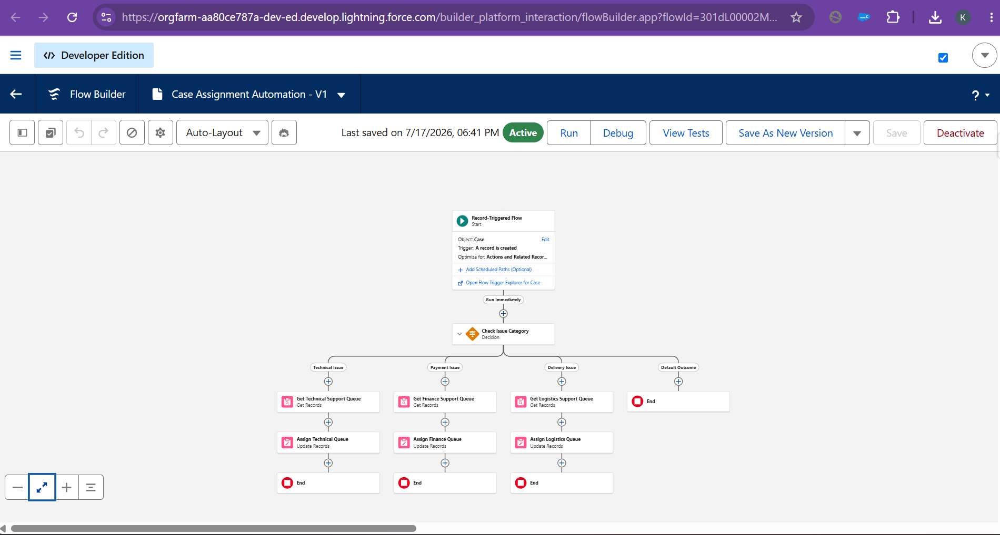
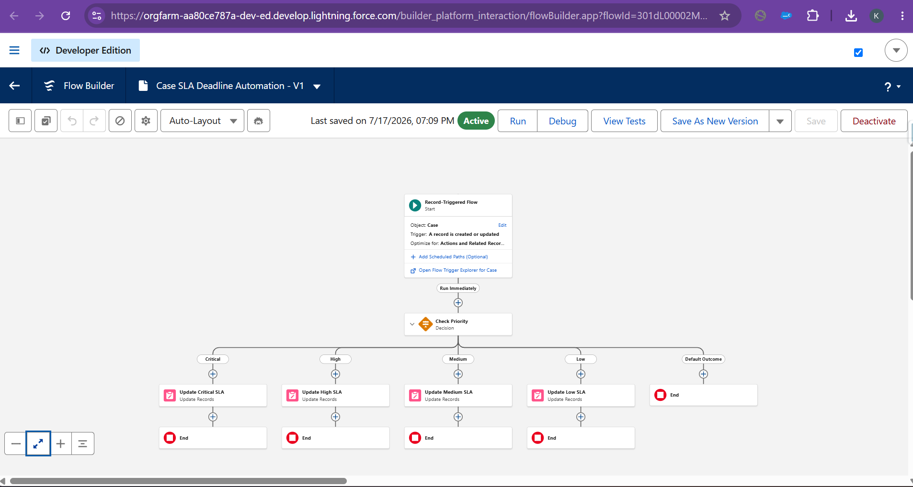
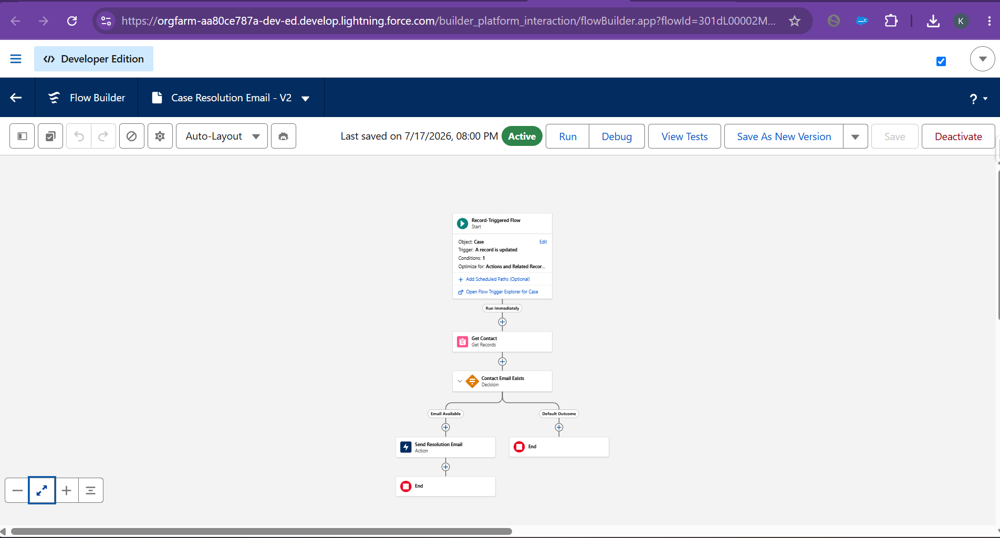
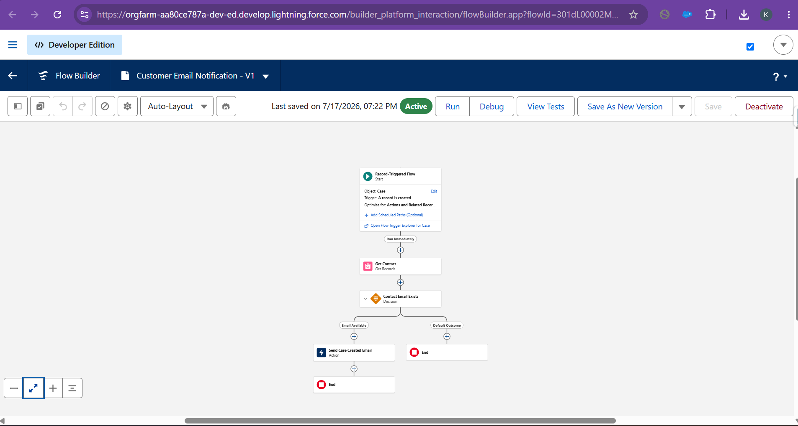
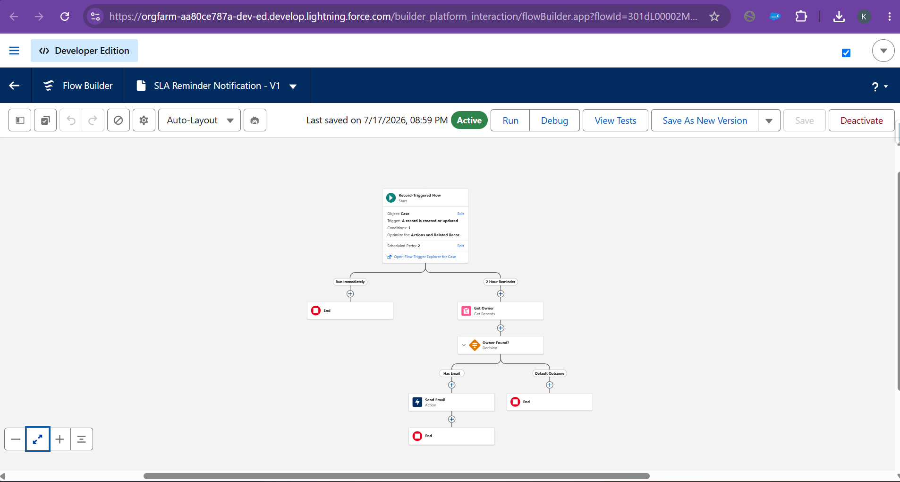

# Chapter 5 – Flow Documentation

## Overview

Salesforce Flow is used to automate key business processes in the Customer Support SLA Management System. These automations minimize manual effort, improve case handling efficiency, ensure SLA compliance, and provide timely notifications to both customers and support agents.

This project includes the following automation flows:

- Case Assignment Automation
- Case SLA Deadline Automation
- Case Resolution Email
- Customer Email Notification
- SLA Reminder Notification

---

# Flow 1 – Case Assignment Automation

## Purpose

Automatically assign newly created support cases to the appropriate support queue based on the issue category.

## Flow Type

Record-Triggered Flow (After Save)

## Trigger

- Object: Case
- Event: After Save
- Executes when a new Case is created.

## Logic

1. A new support case is created.
2. The flow checks the Issue Category.
3. Based on predefined business rules:
   - Technical Issue → Technical Support Queue
   - Billing Issue → Finance Queue
   - Delivery Issue → Logistics Queue
   - General Inquiry → Customer Support Queue
4. The Case Owner is automatically assigned to the appropriate queue.

## Business Benefits

- Eliminates manual case assignment.
- Routes cases to the correct support team.
- Reduces response time.
- Improves operational efficiency.

## Screenshot

```markdown

```

---

# Flow 2 – Case SLA Deadline Automation

## Purpose

Automatically calculate the SLA Deadline for every support case based on its priority level.

## Flow Type

Record-Triggered Flow (Before Save)

## Trigger

- Object: Case
- Event: Before Save
- Executes when a Case is created or its Priority is updated.

## Logic

1. The flow evaluates the Case Priority.
2. Based on the priority, an SLA Deadline is calculated.

Example:

- High Priority → Current Date + 4 Hours
- Medium Priority → Current Date + 8 Hours
- Low Priority → Current Date + 24 Hours

3. The calculated value is stored in the SLA_Deadline__c field.

## Business Benefits

- Automates SLA calculations.
- Ensures consistent SLA deadlines.
- Improves SLA tracking.
- Eliminates manual calculations.

## Screenshot

```markdown

```

---

# Flow 3 – Case Resolution Email

## Purpose

Automatically send a case resolution email to the customer once the support case has been successfully closed.

## Flow Type

Record-Triggered Flow (After Save)

## Trigger

- Object: Case
- Event: After Save
- Executes when the Case Status changes to Closed.

## Logic

1. The support agent resolves the case.
2. The Case Status changes to Closed.
3. The flow automatically sends a resolution email to the customer.
4. The customer receives confirmation that the issue has been resolved.

## Business Benefits

- Improves customer communication.
- Confirms successful case resolution.
- Reduces manual email handling.
- Enhances customer experience.

## Screenshot

```markdown

```

---

# Flow 4 – Customer Email Notification

## Purpose

Automatically send an acknowledgement email to the customer when a new support case is created.

## Flow Type

Record-Triggered Flow (After Save)

## Trigger

- Object: Case
- Event: After Save
- Executes when a new Case is created.

## Logic

1. A customer submits a support request.
2. The Case record is created.
3. The flow automatically sends an acknowledgement email.
4. The customer receives confirmation that the support request has been successfully registered.

## Business Benefits

- Provides instant acknowledgement.
- Improves customer confidence.
- Reduces manual communication.
- Enhances customer experience.

## Screenshot

```markdown

```

---

# Flow 5 – SLA Reminder Notification

## Purpose

Automatically send reminder notifications to the assigned support agent before the SLA deadline.

## Flow Type

Record-Triggered Flow (Scheduled Path)

## Trigger

- Object: Case
- Event: After Save
- Scheduled Path executes before the SLA Deadline.

## Logic

1. A case is assigned to a support agent.
2. The Scheduled Path waits until the configured reminder time.
3. Before the SLA expires, an automated reminder email is sent.
4. The support agent is reminded to resolve the case before the SLA deadline.

## Business Benefits

- Prevents SLA breaches.
- Improves response time.
- Keeps support agents informed.
- Increases SLA compliance.

## Screenshot

```markdown

```

---

# Flow Summary

| Flow Name | Flow Type | Purpose |
|-----------|-----------|---------|
| Case Assignment Automation | Record-Triggered Flow | Automatically assigns support cases to the appropriate support queue. |
| Case SLA Deadline Automation | Record-Triggered Flow | Calculates the SLA Deadline based on case priority. |
| Case Resolution Email | Record-Triggered Flow | Sends a case resolution email after the case is closed. |
| Customer Email Notification | Record-Triggered Flow | Sends an acknowledgement email when a new support case is created. |
| SLA Reminder Notification | Record-Triggered Flow (Scheduled Path) | Sends reminder notifications before the SLA deadline. |

---

# Conclusion

Salesforce Flow automation is a key component of the Customer Support SLA Management System. These five automation flows streamline case assignment, SLA deadline calculation, customer communication, case resolution notifications, and SLA reminders. By automating repetitive business processes, the system improves operational efficiency, enhances customer experience, increases SLA compliance, and enables support teams to resolve cases more effectively.