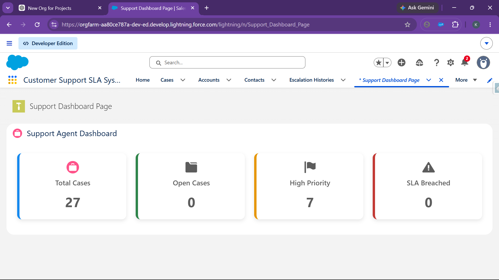
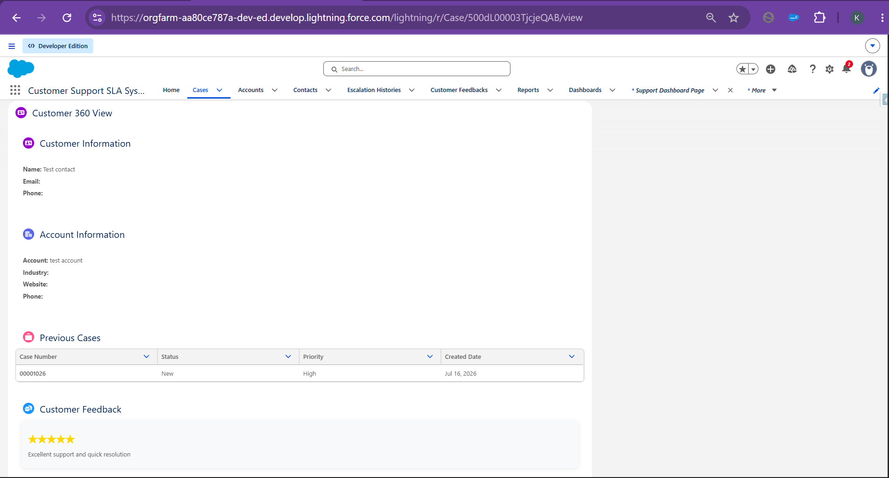
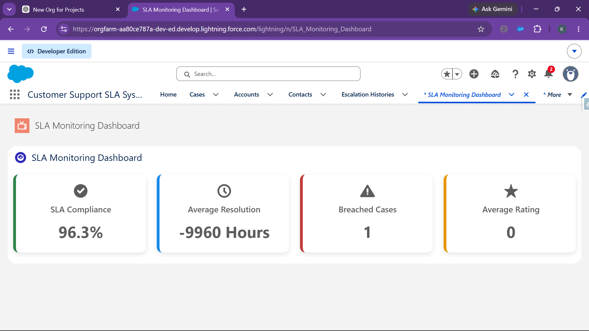
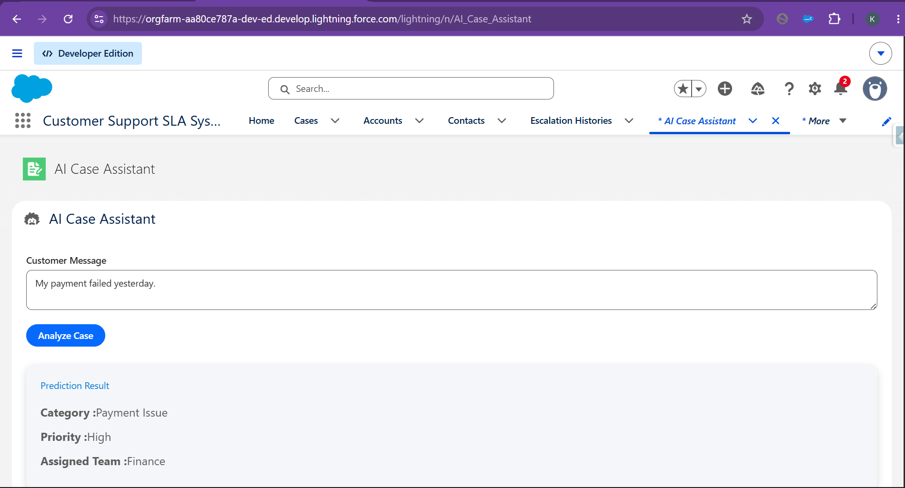

# Chapter 7 – Lightning Web Components Documentation

## Overview

Lightning Web Components (LWCs) provide the interactive user interface for the Customer Support SLA Management System. These components allow support agents and managers to efficiently manage cases, monitor SLA performance, view customer information, and utilize AI-assisted case classification.

The project includes four custom Lightning Web Components:

- Support Agent Dashboard
- Customer 360 View
- SLA Monitoring Dashboard
- AI Case Assistant

---

# 1. Support Agent Dashboard

## Purpose

The Support Agent Dashboard provides a centralized view of important case metrics, allowing support agents to quickly understand their workload and monitor assigned cases.

## Features

- Displays total assigned cases.
- Shows open cases.
- Shows closed cases.
- Displays high-priority cases.
- Responsive dashboard layout.
- Error handling using Salesforce Toast Messages.
- Loading spinner while dashboard data is retrieved.

## Technologies Used

- Lightning Web Component (LWC)
- Apex Controller
- Lightning Cards
- Lightning Layout
- ShowToastEvent

## Screenshot

> Insert the Support Agent Dashboard screenshot below.

```markdown

```

---

# 2. Customer 360 View

## Purpose

The Customer 360 View provides support agents with a complete view of customer information, previous support cases, and customer feedback from a single screen.

## Features

- Displays customer details.
- Displays related Account information.
- Shows previous support cases.
- Displays customer feedback and ratings.
- Responsive card layout.
- Lightning Datatable for case history.
- Error notification using Salesforce Toast.

## Technologies Used

- Lightning Web Component (LWC)
- Apex Controller
- Lightning Card
- Lightning Datatable
- ShowToastEvent

## Screenshot

> Insert the Customer 360 View screenshot below.

```markdown

```

---

# 3. SLA Monitoring Dashboard

## Purpose

The SLA Monitoring Dashboard enables managers to monitor SLA performance by displaying important metrics related to case resolution and SLA compliance.

## Features

- Displays SLA Compliance.
- Shows breached SLA cases.
- Displays average customer rating.
- Displays average resolution time.
- Responsive dashboard cards.
- Loading spinner while retrieving dashboard data.
- Error handling using Salesforce Toast Messages.

## Technologies Used

- Lightning Web Component (LWC)
- Apex Controller
- Lightning Cards
- Lightning Layout
- ShowToastEvent

## Screenshot

> Insert the SLA Monitoring Dashboard screenshot below.

```markdown

```

---

# 4. AI Case Assistant

## Purpose

The AI Case Assistant provides AI-inspired case classification by analyzing customer messages and automatically recommending the most appropriate Category, Priority, and Support Team.

## Features

- Customer message input.
- Analyze Case button.
- Predicts Case Category.
- Predicts Priority.
- Suggests Support Team.
- Keyword-based AI logic.
- Clean and responsive interface.
- Real-time classification results.

## Technologies Used

- Lightning Web Component (LWC)
- Apex Controller
- Lightning Textarea
- Lightning Button
- Lightning Cards

## Example

### Customer Message

```
My payment failed while placing my order.
```

### AI Prediction

| Field | Result |
|--------|--------|
| Category | Payment Issue |
| Priority | High |
| Team | Finance |

## Screenshot

> Insert the AI Case Assistant screenshot below.

```markdown

```

---

# LWC Summary

| Lightning Web Component | Purpose |
|--------------------------|---------|
| Support Agent Dashboard | Displays key case metrics for support agents |
| Customer 360 View | Provides a complete customer profile with related cases and feedback |
| SLA Monitoring Dashboard | Displays SLA performance metrics and compliance information |
| AI Case Assistant | Classifies customer messages and recommends Category, Priority, and Support Team |

---

# Conclusion

The Lightning Web Components developed for this project provide a modern, responsive, and user-friendly interface for customer support operations. By integrating Apex controllers, Salesforce data, and custom business logic, these components improve productivity, enhance decision-making, and deliver an efficient support experience. The AI Case Assistant further demonstrates how intelligent automation can simplify case classification and improve support workflows.