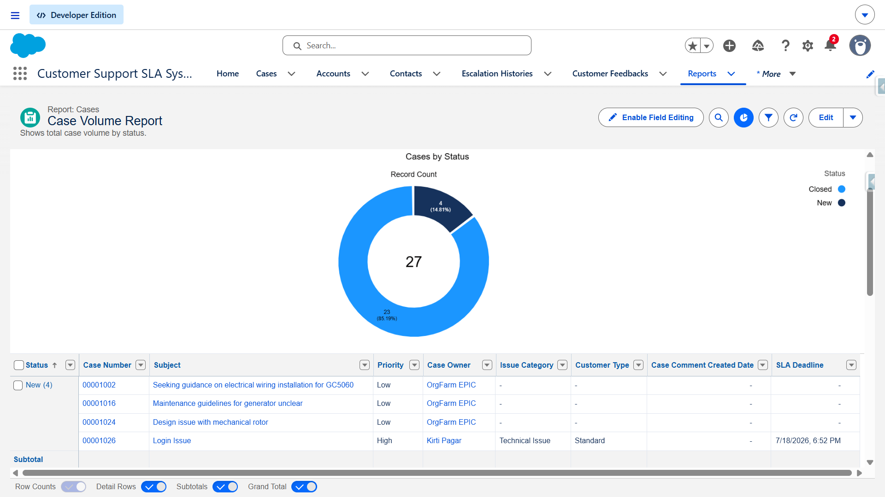
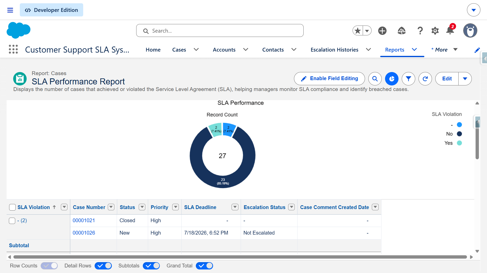
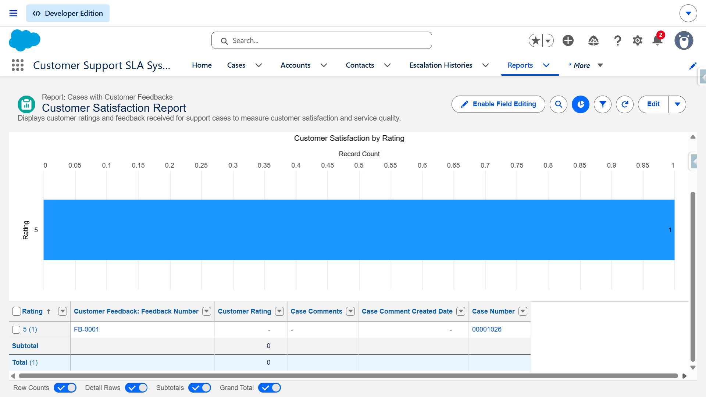
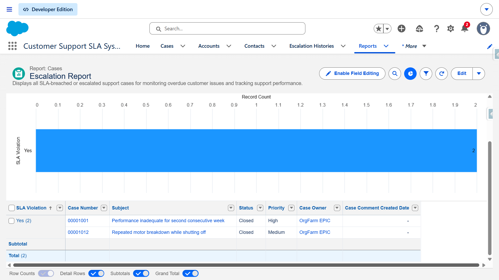
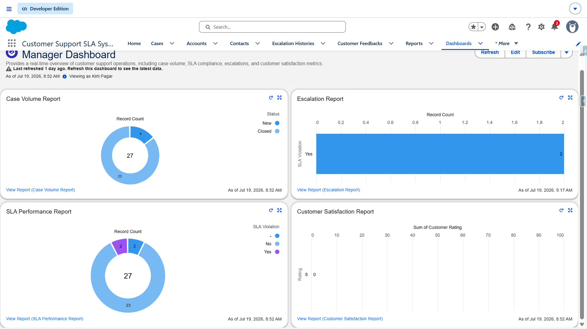

# Chapter 8 – Reports & Dashboards Documentation

## Overview

Salesforce Reports and Dashboards provide valuable insights into support operations by transforming case data into meaningful business metrics. They enable support managers to monitor case volume, SLA compliance, customer satisfaction, and escalated cases in real time, helping them make informed decisions and improve overall support performance.

This project includes four custom reports and one management dashboard.

---

# Report 1 – Case Volume Report

## Purpose

The Case Volume Report provides an overview of customer support cases based on their current status. It helps managers understand the distribution of new, working, and closed cases.

## Report Type

Cases

## Filters

- Show Me: All Cases
- Date Field: Created Date
- Range: All Time

## Grouping

Grouped by:

**Status**

Example:

- New
- Working
- Closed

## Chart

- Chart Type: Donut Chart
- Chart Title: **Case Volume**
- Value: Record Count
- Slice By: Status

## Business Insights

- Identifies workload distribution.
- Shows the number of open and closed cases.
- Helps managers monitor support activity.

## Screenshot

> Insert the Case Volume Report screenshot below.

```markdown

```

---

# Report 2 – SLA Performance Report

## Purpose

The SLA Performance Report monitors whether support cases are meeting SLA requirements or have breached their SLA deadlines.

## Report Type

Cases

## Filters

- Show Me: All Cases
- Date Field: Created Date
- Range: All Time

Additional Filter:

- SLA Violation = True/False

## Grouping

Grouped by:

**SLA Violation**

Example:

- False (SLA Achieved)
- True (SLA Breached)

## Chart

- Chart Type: Donut Chart
- Chart Title: **SLA Performance**
- Value: Record Count
- Slice By: SLA Violation

## Business Insights

- Measures SLA compliance.
- Highlights breached cases.
- Helps managers improve service performance.

## Screenshot

> Insert the SLA Performance Report screenshot below.

```markdown

```

---

# Report 3 – Customer Satisfaction Report

## Purpose

The Customer Satisfaction Report analyzes customer ratings and feedback collected after case resolution.

## Report Type

Customer Feedback

## Filters

- Show Me: All Feedback
- Date Field: Created Date
- Range: All Time

## Grouping

Grouped by:

**Rating**

Example:

- ★★★★★
- ★★★★☆
- ★★★☆☆
- ★★☆☆☆
- ★☆☆☆☆

## Chart

- Chart Type: Horizontal Bar Chart
- Chart Title: **Customer Satisfaction**
- Value: Record Count
- Group By: Rating

## Business Insights

- Measures customer satisfaction.
- Identifies service quality trends.
- Helps improve customer experience.

## Screenshot

> Insert the Customer Satisfaction Report screenshot below.

```markdown

```

---

# Report 4 – Escalation Report

## Purpose

The Escalation Report displays all cases that have breached their SLA and require management attention.

## Report Type

Cases

## Filters

- Show Me: All Cases
- Date Field: Created Date
- Range: All Time

Additional Filter:

- SLA Violation = True

## Grouping

Grouped by:

**Priority**

Example:

- High
- Medium
- Low

## Chart

- Chart Type: Vertical Bar Chart
- Chart Title: **Escalated Cases**
- Value: Record Count
- Group By: Priority

## Business Insights

- Identifies critical overdue cases.
- Highlights escalation trends.
- Helps managers prioritize urgent issues.

## Screenshot

> Insert the Escalation Report screenshot below.

```markdown

```

---

# Dashboard – Customer Support Dashboard

## Purpose

The Customer Support Dashboard provides managers with a centralized view of key support metrics through interactive dashboard components.

## Dashboard Components

### 1. Case Volume

Displays the distribution of support cases by status.

Source Report:

- Case Volume Report

---

### 2. SLA Compliance

Displays SLA achieved versus SLA breached cases.

Source Report:

- SLA Performance Report

---

### 3. Customer Satisfaction

Displays customer rating statistics collected through feedback.

Source Report:

- Customer Satisfaction Report

---

### 4. Escalation Count

Displays the total number of escalated support cases.

Source Report:

- Escalation Report

---

## Business Insights

The dashboard enables managers to:

- Monitor overall case volume.
- Track SLA compliance.
- Identify overdue cases.
- Measure customer satisfaction.
- Improve operational efficiency.
- Support data-driven decision-making.

---

## Screenshot

> Insert the Customer Support Dashboard screenshot below.

```markdown

```

---

# Reports & Dashboard Summary

| Report / Dashboard | Primary Purpose |
|--------------------|-----------------|
| Case Volume Report | Monitor the distribution of support cases by status. |
| SLA Performance Report | Track SLA compliance and identify breached cases. |
| Customer Satisfaction Report | Analyze customer ratings and feedback. |
| Escalation Report | Display overdue cases requiring management attention. |
| Customer Support Dashboard | Provide a consolidated view of key support performance metrics. |

---

# Conclusion

Salesforce Reports and Dashboards transform operational data into actionable insights for support managers. 
By monitoring case volume, SLA performance, customer satisfaction, and escalated cases in one place, the Customer Support Dashboard enables better decision-making, improves team productivity, and helps ensure high-quality customer service.